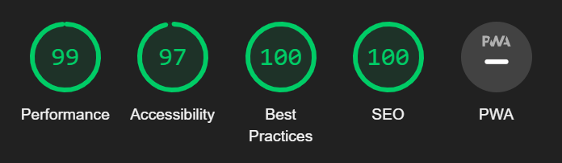

# kanban-board-project
This is a project after completing the Java script course. Below is a description and requirements for the project.
- To run the project locally, click the "fork" button
- Run a git clone on your workstation
- npm install
- npm run start
- Open browser add a task

<h2>Lighthouse</h2>

